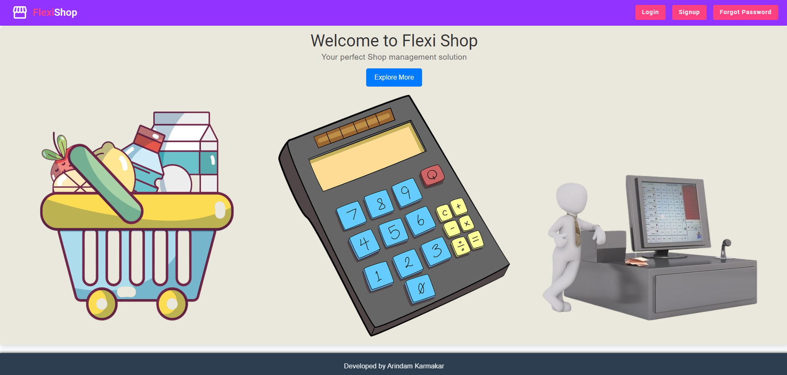
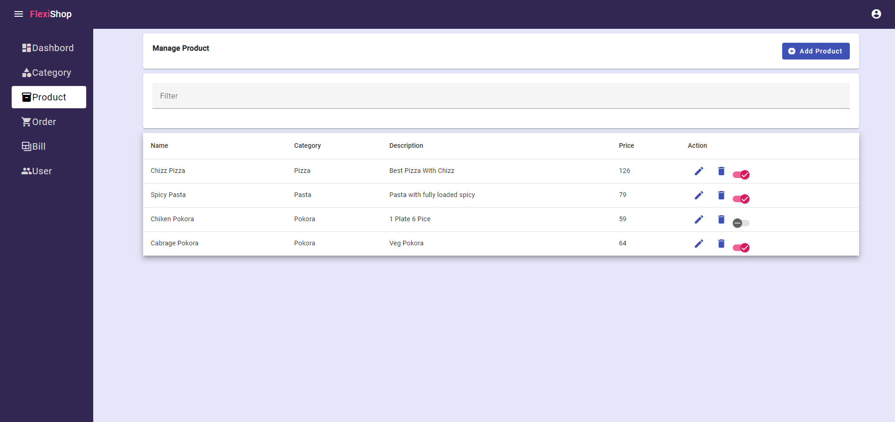
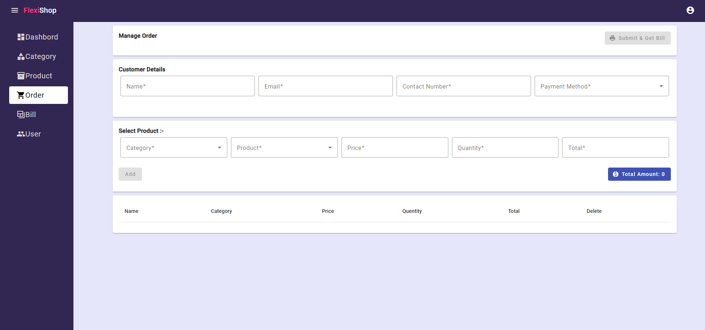
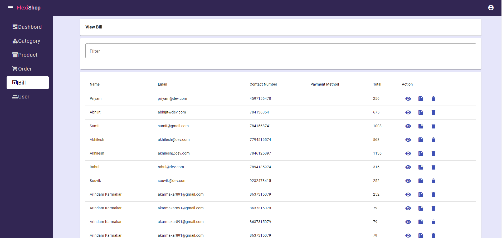

# FlexiShop

FlexiShop is a web application built to manage shops efficiently. It provides functionalities for administrators to manage users, product categories, products, and bills. Users can sign up, manage their profile, generate bills for purchases, and view their bill history once approved by the admin.

## Features

### For Admins:
- **Authentication and Authorization:**
  - Admins can log in securely using JWT authentication.
  - User accounts require admin approval to access features.

- **User Management:**
  - Admins can approve or reject user sign-ups.
  - Users can be granted access to the system upon approval.

- **Product and Category Management:**
  - Admins can add, update, and delete product categories.
  - Products can be added to specific categories with details like name, price, and description.

- **Bill Management:**
  - Generate bills for customer purchases, including details of products, total amounts, and payment methods.
  - Maintain a record of all generated bills.

### For Users:
- **User Authentication:**
  - Users can sign up and log in to the system.
  - Access to features requires approval from an admin.

- **Profile Management:**
  - Users can update their profile information after approval.

- **Bill Generation and Viewing:**
  - Generate bills for purchases made.
  - View a history of all bills generated by the user.

### Common Features:
- **PDF Generation and Download:**
  - Both admins and users can generate bills in PDF format.
  - PDFs can be downloaded for offline access or printing.
## Screenshots

Below are some screenshots of the FlexiShop application:

*Login Page*

*Product Page*

*Generate Bill*

*Bills Management*

## Technologies Used

- **Backend:**
  - Java Spring Boot for building the RESTful API.
  - MySQL database for storing user, product, category, and bill information.

- **Frontend:**
  - Angular 12 for the user interface.
  - Angular Material for UI components and styling.

## Setup Instructions

1. **Backend Setup:**
   - Clone the repository.
   - Import the backend (Java Spring Boot) project into your preferred IDE (IntelliJ IDEA, Eclipse, etc.).
   - Configure `application.properties` to connect to your MySQL database.

2. **Database Setup:**
   - Create a MySQL database named `flexi_shop`.
   - Update `application.properties` with your database credentials.

3. **Frontend Setup:**
   - Navigate to the `frontend` directory.
   - Install dependencies using `npm install`.
   - Run the frontend using `ng serve`.

4. **Running the Application:**
   - Start the Spring Boot application from your IDE.
   - Access the application at `http://localhost:8081`.
   - Login as an admin to manage users, categories, products, and bills.

## API Endpoints

- **User Management:**
  - `/user/signup`: POST - Sign up a new user.
  - `/user/login`: POST - Login user.
  - `/user/approve/{userId}`: POST - Approve a user by admin.

- **Category Management:**
  - `/category/add`: POST - Add a new product category.
  - `/category/update`: POST - Update an existing product category.
  - `/category/get`: GET - Get all product categories.

- **Product Management:**
  - `/product/add`: POST - Add a new product.
  - `/product/update`: POST - Update an existing product.
  - `/product/get`: GET - Get all products.
  - `/product/delete/{productId}`: POST - Delete a product.

- **Bill Management:**
  - `/bill/generateReport`: POST - Generate a bill.
  - `/bill/getPdf`: POST - Get PDF of a generated bill.
  - `/bill/getBills`: GET - Get all bills.
  - `/bill/delete/{billId}`: POST - Delete a bill.

## Authors

- Arindam Karmakar

i am just learning fork concept
